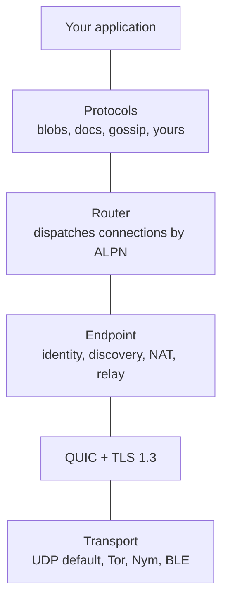

iroh is a modular networking stack written in Rust. It provides
the building blocks to create applications that can communicate
using fast, cheap, and reliable connections.

## Core features
- **Fast**: iroh enables direct connections between
  devices, allowing them to communicate without relying on centralized servers.
- **Reliable**: iroh is designed to work in challenging network conditions.  It
uses relay servers as a fallback when direct connections are not possible.
- **Secure**: All connections established through iroh are authenticated and
encrypted end-to-end using the QUIC protocol, ensuring data privacy and
integrity.
- **Modular**: iroh is built around a system of composable protocols
  that can be mixed and matched to suit the needs of different applications. This
  allows developers to easily add functionality such as file sharing, messaging,
  and real-time collaboration.

## Use cases
- **Local-first, offline-first, peer-to-peer applications**: iroh provides the networking foundation for
  building applications that can operate without reliance on servers.
- **Files & blobs**: With protocols like [iroh-blobs](/protocols/blobs), iroh enables efficient
  file transfer.
- **Structured data**: iroh's support for flexible data protocols like [KV
CRDTs](/protocols/kv-crdts) and [Automerge](/protocols/automerge) allows
developers to build applications that support real-time collaborative editing
and data synchronization. Any kind of CRDT or OT sync protocol can be integrated.
- **Real-time communication**: Build [chat applications](/examples/chat), [RPC
services](/protocols/rpc), and [streaming data](/protocols/streaming) with
iroh's communication protocols.

## How the pieces stack together

An iroh application is a stack of small layers, each with one job:



- **Transport** carries encrypted bytes between machines. UDP is the default;
  you can swap in [Tor](/transports/tor), [Nym](/transports/nym), or
  [Bluetooth](/transports/bluetooth) when you need a different wire.
- **QUIC + TLS 1.3** provides end-to-end encryption, authentication, and
  stream multiplexing over that transport.
- **[Endpoint](/concepts/endpoints)** is the connection-level API. It gives
  each node a stable `EndpointID`, finds peers through
  [discovery](/concepts/discovery), traverses NATs, and falls back to
  [relays](/concepts/relays) when a direct path isn't available.
- **Router** listens on an endpoint and dispatches each incoming connection to
  the right protocol handler based on its
  [ALPN](/concepts/protocols) string. This is what lets several protocols
  share one endpoint.
- **[Protocols](/concepts/protocols)** define what two peers actually do once
  connected — transfer files, sync documents, broadcast messages. Mix them
  freely: `iroh-docs`, for example, is built on top of `iroh-blobs` and
  `iroh-gossip`.

Composing multiple protocols on a single endpoint looks like this:

```rust
use iroh::{protocol::Router, Endpoint};
use iroh_blobs::{store::mem::MemStore, BlobsProtocol};
use iroh_gossip::net::Gossip;

let endpoint = Endpoint::bind(presets::N0).await?;

// Two independent protocols, sharing one endpoint.
let store = MemStore::new();
let blobs = BlobsProtocol::new(&store, None);
let gossip = Gossip::builder().spawn(endpoint.clone());

// The router routes each incoming connection to the right handler by ALPN.
let _router = Router::builder(endpoint)
    .accept(iroh_blobs::ALPN, blobs)
    .accept(iroh_gossip::ALPN, gossip)
    .spawn();
```

Two `accept` calls, one endpoint: both blobs and gossip are now reachable on
this node, routed by their ALPN.

## Getting started
To get started with iroh, check out the [quickstart guide](/quickstart) or explore the
[protocols documentation](/protocols/kv-crdts) to see what protocols are available and
how to use them in your applications.

Read the [how it works documentation](/concepts/endpoints) to understand the underlying
principles and architecture of iroh.