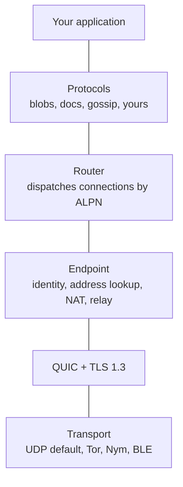

iroh is a modular networking stack written in Rust. It provides the building
blocks to create applications that can communicate using fast, cheap, and
reliable connections.

It's a lightweight native library meant to be embedded directly into your
application — in Rust, or in C, C++, Swift, Python, JavaScript, and Kotlin
through [our bindings](/languages).

<Frame>
  
</Frame>

## Core features
- **Fast**: iroh enables direct connections between
  devices, allowing them to communicate without relying on centralized servers.
- **Reliable**: iroh is designed to work in challenging network conditions.  It
uses relay servers as a fallback when direct connections are not possible.
- **Secure**: All connections established through iroh are authenticated and
encrypted end-to-end using the QUIC protocol, ensuring data privacy and
integrity.
- **Modular**: iroh is built around a system of composable protocols
  that can be mixed and matched to suit the needs of different applications. This
  allows developers to easily add functionality such as file sharing, messaging,
  and real-time collaboration.

## Use cases
- **Local-first, offline-first, peer-to-peer applications**: iroh provides the networking foundation for
  building applications that can operate without reliance on servers.
- **Files & blobs**: With protocols like [iroh-blobs](/protocols/blobs), iroh enables efficient
  file transfer.
- **Structured data**: iroh's support for flexible data protocols like
[Documents](/protocols/documents) and [Automerge](/protocols/automerge) allows
developers to build applications that support real-time collaborative editing
and data synchronization. Any kind of CRDT or OT sync protocol can be integrated.
- **Real-time communication**: Build [chat applications](/examples/chat), [RPC
services](/protocols/rpc), and [streaming data](/protocols/streaming) with
iroh's communication protocols.

## How iroh works

iroh's job comes down to two promises: you can reach a peer no matter where it
is, and the connection you get is the best one available.

### Connect by key

Every iroh [endpoint](/concepts/endpoints) is identified by a cryptographic key.
That key — not an IP address — is the address. It lets you connect to a peer no
matter where it is, even as its network location changes underneath it.

<Frame>
  
</Frame>

### Reliable connections

We make sure you get a connection whenever possible, and that it's as fast as
possible. When network conditions change, iroh immediately reacts and switches
to the new best path — transparently, without dropping the connection.

<Frame>
  
</Frame>

Now that we've seen *what* iroh does, here's *how*.

### Library and relays

There are two pieces to the system:

- **The iroh library** runs inside your application. It provides the API to
  create endpoints, connect to other endpoints, and open connections and data
  streams.
- **[Relays](/concepts/relays)** run in the background on publicly reachable
  servers. They help endpoints find each other and establish direct
  connections, and relay data as a fallback when a direct connection isn't
  possible.

### Endpoint startup

An iroh endpoint is configured with a set of relays — the rate-limited public
relays operated by number 0, relays from iroh services, or self-hosted ones.
iroh works fine with a single relay, but works best with relays in every region
where your users are.

On startup, an endpoint sends
[QAD](https://datatracker.ietf.org/doc/draft-ietf-quic-address-discovery/)
probes to all configured relays. This does two things: it learns the endpoint's
own public IP address, and it learns which relay is closest by latency. The
closest relay becomes the **home relay**, and the endpoint keeps a secure
WebSocket connection open to it.

<Frame>
  
</Frame>

### Finding peers

When there are multiple relays, Alice needs to know which relay to use to reach
Bob. iroh offers two ways to publish and look up that information.

#### DNS-based lookup

Out of the box, iroh uses DNS. Bob publishes a signed record with his home relay
to a DNS server operated by number 0 via an HTTPS `PUT`. Anyone who wants to
reach Bob resolves that record with a DNS or HTTPS query. See
[DNS address lookup](/connecting/dns-address-lookup).

<Frame>
  
</Frame>

#### Mainline DHT lookup

DNS works in most cases, but sometimes you want something fully peer-to-peer.
For that, iroh offers an optional lookup over the Mainline DHT: it publishes the
exact same signed record using the
[BEP 44](https://www.bittorrent.org/beps/bep_0044.html) extension. See
[DHT address lookup](/connecting/dht-address-lookup).

<Frame>
  
</Frame>

### Direct connections

So far we've described a system where endpoints can always talk — but all data
flows through the relays. That adds latency, limits throughput, and costs the
relay operator money. Making connections fast and direct is arguably the most
complex part of the system.

#### Hole punching

Hole punching happens *inside* the QUIC connection via an
`n0_nat_traversal` extension, inspired by the
[QUIC NAT traversal draft](https://datatracker.ietf.org/doc/draft-seemann-quic-nat-traversal/)
but using its own transport parameter ID. See
[NAT traversal](/concepts/nat-traversal).

<Frame>
  
</Frame>

#### Local connections

If two devices are on the same network, hole punching isn't needed — each side
just needs to learn the other's local address. See
[local address lookup](/connecting/local-address-lookup).

<Frame>
  
</Frame>

## How the pieces stack together

An iroh application is a stack of small layers, each with one job:



- **Transport** carries encrypted bytes between machines. UDP is the default;
  you can swap in [Tor](/transports/tor), [Nym](/transports/nym), or
  [Bluetooth](/transports/bluetooth) when you need a different wire.
- **QUIC + TLS 1.3** provides end-to-end encryption, authentication, and
  stream multiplexing over that transport.
- **[Endpoint](/concepts/endpoints)** is the connection-level API. It gives
  each node a stable `EndpointID`, finds peers through
  [address lookup](/concepts/address-lookup), traverses NATs, and falls back to
  [relays](/concepts/relays) when a direct path isn't available.
- **Router** listens on an endpoint and dispatches each incoming connection to
  the right protocol handler based on its
  [ALPN](/concepts/protocols) string. This is what lets several protocols
  share one endpoint.
- **[Protocols](/concepts/protocols)** define what two peers actually do once
  connected — transfer files, sync documents, broadcast messages. Mix them
  freely: `iroh-docs`, for example, is built on top of `iroh-blobs` and
  `iroh-gossip`.

Composing multiple protocols on a single endpoint looks like this:

```rust
use iroh::{protocol::Router, Endpoint};
use iroh_blobs::{store::mem::MemStore, BlobsProtocol};
use iroh_gossip::net::Gossip;

let endpoint = Endpoint::bind(presets::N0).await?;

// Two independent protocols, sharing one endpoint.
let store = MemStore::new();
let blobs = BlobsProtocol::new(&store, None);
let gossip = Gossip::builder().spawn(endpoint.clone());

// The router routes each incoming connection to the right handler by ALPN.
let _router = Router::builder(endpoint)
    .accept(iroh_blobs::ALPN, blobs)
    .accept(iroh_gossip::ALPN, gossip)
    .spawn();
```

Two `accept` calls, one endpoint: both blobs and gossip are now reachable on
this node, routed by their ALPN.

## Getting started
To get started with iroh, check out the [quickstart guide](/quickstart) or explore the
[protocols documentation](/protocols/documents) to see what protocols are available and
how to use them in your applications.

Read the [how it works documentation](/concepts/endpoints) to understand the underlying
principles and architecture of iroh.
